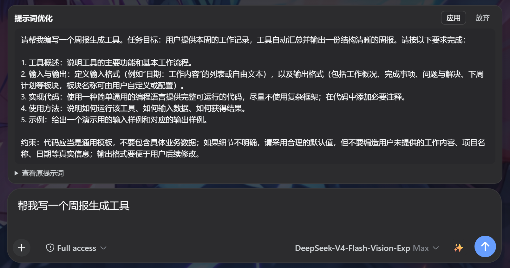
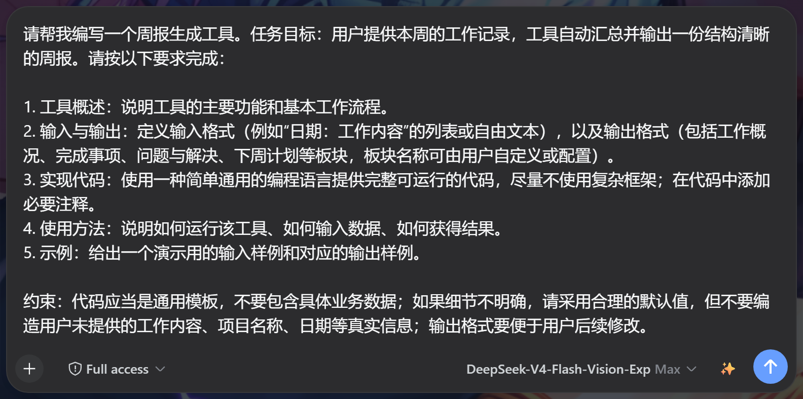

# dsh-prompt-optimize-plugin

> DeepSeek Harness 输入栏「提示词优化」插件 —— 一键把模糊的提示词改写成清晰、具体、可执行,像 IDE 里的智能提示一样顺手。

[](LICENSE)
[](https://www.npmjs.com/package/dsh-prompt-optimize-plugin)


## 效果展示

**✨ 优化按钮位置**(发送按钮左侧)


**优化对比面板**(输入框正上方,原文 → 结构化优化结果)


**面板 + 输入栏全景**



**点击「应用」后**(草稿被替换为优化文本)



> 以上为当前版本(0.0.2/v10)真实运行截图(`docs/assets/`);演示草稿为通用示例「帮我写一个周报生成工具」。截图可由 `scripts/demo-shots.mjs` 自动重新生成。

## ✨ 核心亮点

- **一句话提炼** — 点击即优化,模糊需求立即变成结构化的高质量提示词;
- **不换模型** — 使用当前会话默认模型,零配置,零附加成本;
- **看得见的对比** — 优化前 vs 优化后同屏对照,「应用 / 放弃」由你决定;
- **干净可逆** — 不修改你的草稿直到你点「应用」,随时可撤回;
- **会话隔离** — 面板状态绑定会话,切换会话即清空,不串台;
- **错误兜底** — 模型不可用/超时/无输出时给出可读错误,不阻塞输入。

## 安装与使用

### 方式一:Dynamic 模式(开发/尝鲜)

在 DSH 的 Cordis 动态插件面板:

1. 新建插件(idPrefix 如 `pmopt`);
2. `code.host` 粘贴 `src/host.js`,`code.client` 粘贴 `src/client.js` 全文;
3. 激活并授权,即出现 ✨ 按钮。

### 方式二:静态插件(npm 包,正式推荐)

```powershell
dsh plugin --profile web add dsh-prompt-optimize-plugin
```

然后在 `~/.dsh/profiles/web/cordis.patch.yml` 注册插件行:

```yaml
- insert:
    - id: dsh-prompt-optimize
      name: 'dsh-prompt-optimize-plugin'
```

重启 DSH web 服务(`Restart-Service DSHWeb`)后生效。

> 两种形态共用同一份 `src/` 原文;`lib/` 为静态化适配产物(webServer 路由 + 模块加载器工厂)。

## 架构

```
┌────────────────────────── 浏览器(Client 半部) ──────────────────────────┐
│ conversation.input.right   注册 ✨ 按钮(list 槽,order 0)                  │
│ conversation.input.overlay 注册对比面板(浮动锚,order 2)                  │
│   按钮点击 → POST /prompt-optimize { text }                              │
└──────────────────────────────────┬───────────────────────────────────────┘
                                   │       本地 HTTP(webServer 路由)
┌──────────────────────────────────▼───────────────────────────────────────┐
│ DSH 宿主进程(Host 半部 · lib/index.js)                                    │
│ 1. 校验草稿非空                                                          │
│ 2. agentDefaultModel.currentSelection() → { provider, model }             │
│ 3. llm.stream({ provider, model, messages, system, maxTokens: 4096,       │
│                temperature: 0.3 })                                        │
│    · 按 index 拼接 text-delta;无文本时兜底拼接 reasoning-delta            │
│    · finish 的 error/aborted → 失败                                       │
│ 4. 返回 { ok: true, text } | { ok: false, error }                         │
└───────────────────────────────────────────────────────────────────────────┘
```

### 关键契约

| 项 | 值 |
|---|---|
| 按钮插槽 | `conversation.input.right`(list, session 作用域),props 含 `useInput` / `inputActions` / `sessionId` |
| 面板插槽 | `conversation.input.overlay`(浮动锚,锚于 `[data-composer-card]` 顶部) |
| 通信 | 动态:`host.call('prompt-optimize')`;静态:`POST /prompt-optimize` JSON |
| 模型来源 | `agentDefaultModel.currentSelection()` |
| LLM 调用 | `llm.stream(options: GenerateOptions)`,`maxTokens 4096`、`temperature 0.3` |
| 草稿写入口 | `InputActions.setDraft(text)` |
| 输入状态 | `useInput((s) => s)` → `InputState.draft` |
| 系统提示词 | `OPTIMIZE_SYSTEM`(`src/host.js` 与 `lib/index.js` 同源):任务目标与预期输出、必要上下文(仅基于用户提供信息)、五步改写流程、输出格式与长度、约束条件(不编造具体事实、保留原文要素) |

## 目录结构

```
dsh-prompt-optimize-plugin/
├── README.md            # 本文档
├── LICENSE              # MIT 许可证
├── package.json         # 发行包元数据
├── .gitignore
├── src/                 # 动态插件原始源码(函数体,保持与线上动态实例一致)
│   ├── host.js
│   └── client.js
├── lib/                 # 静态化适配产物(cordis 插件包)
│   ├── index.js         # Host 半部:webServer POST /prompt-optimize
│   └── client.js        # Client 半部:__ModuleLoader__ 工厂 + fetch
├── docs/
│   ├── changelog.md     # 迭代历史(pkg-1 … pkg-10 + npm 发布记录)
│   ├── juejin.md        # 掘金平台介绍文案
│   ├── douyin-script.md # 抖音短视频脚本
│   └── assets/          # 效果展示图(真实运行截图)
├── scripts/
│   └── demo-shots.mjs   # 演示截图脚本(puppeteer-core,自动化生成 assets 效果图)
├── CONTRIBUTING.md      # 贡献指南
└── CODE_OF_CONDUCT.md   # 行为准则
```

> `src/host.js` / `src/client.js` 是动态插件闭包函数体(顶层 `return { … }`),不能直接 `require`;请按上方「方式一」粘贴使用,或直接使用 `lib/` 静态形态。

## 开发与贡献

- 环境:Node.js ≥ 20、pnpm;
- 代码是纯 JavaScript(无 TS/JSX 编译),改动后建议先 `node --check` 校验语法;
- 贡献流程、提交规范与 PR 要求见 [CONTRIBUTING.md](CONTRIBUTING.md);
- 参与社区请遵守 [CODE_OF_CONDUCT.md](CODE_OF_CONDUCT.md)。

## 许可证

[MIT](LICENSE) © dsh-prompt-optimize-plugin contributors
